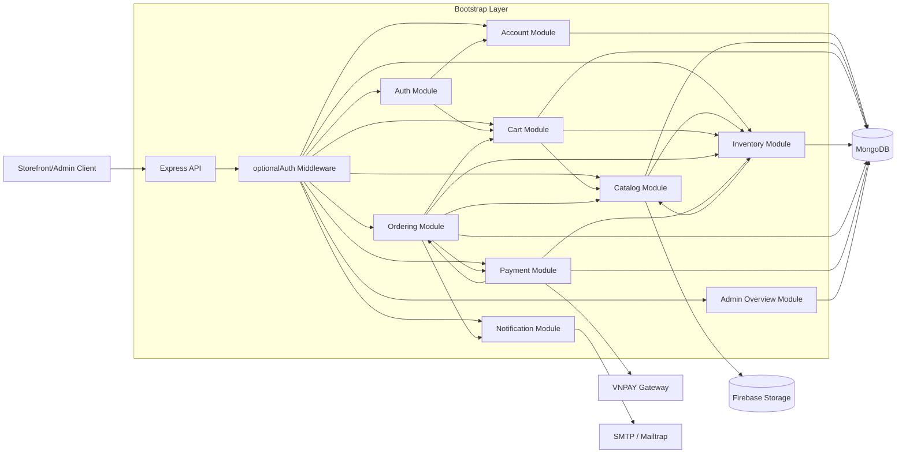

# Backend Architecture

Tài liệu này mô tả kiến trúc backend hiện tại của `apps/backend` theo code thực tế đang wiring trong `src/bootstrap/modules.js`.

## Runtime Topology

Khi chạy bằng Docker Compose, backend hoạt động với các thành phần chính:

- `backend` (`Express`, chạy cổng mặc định `3000`)
- `mongo` (`MongoDB`, persistence chính)
- external systems:
- `VNPAY` (cổng thanh toán)
- `SMTP/Mailtrap` (gửi email)
- `Firebase Storage` (lưu ảnh biến thể sản phẩm, optional)

## Bootstrap Pipeline

Luồng khởi động backend:

1. `index.js` load env (`dotenv/config`) và gọi `createApp()`.
2. `createApp()` kết nối MongoDB, khởi tạo storage adapter (nếu có cấu hình).
3. Mount middlewares nền tảng: `express.json()`, `cookie-parser()`.
4. `registerModules()` đăng ký module và wiring liên module.
5. Mount global error handler.

## Architecture Diagram

## Module Boundaries

### `account`

- Sở hữu persistence và dịch vụ account.
- Không xử lý auth session/token.

### `auth`

- Xử lý register/login/logout/current-user.
- Sử dụng `account` để đọc/ghi user.
- Tái gán guest cart sang customer cart sau đăng ký thông qua `cartServices`.

### `catalog`

- Quản lý sản phẩm/biến thể/reference data cho storefront và admin.
- Tích hợp inventory read model để hiển thị tồn kho live.
- Tích hợp Firebase Storage để upload/delete ảnh variant.

### `cart`

- Quản lý giỏ hàng guest/customer.
- Validate purchasable bằng dữ liệu từ `catalog` + `inventory`.
- Reconcile cart định kỳ theo trạng thái catalog/inventory mới nhất.

### `inventory`

- Quản lý tồn kho theo `variantId`.
- Cấp API admin chỉnh tồn kho và API đọc tồn kho.

### `ordering`

- Điều phối vòng đời đơn hàng.
- Tạo đơn từ cart, cập nhật trạng thái đơn, hủy đơn.
- Kết nối payment checkout adapter + notification email.

### `payment`

- Quản lý payment record.
- Tạo URL thanh toán VNPAY.
- Nhận `return` + `IPN`, verify chữ ký, reconcile trạng thái payment/order.

### `notification`

- Gửi email (SMTP/Mailtrap adapter).
- Đang được dùng cho email xác nhận đơn hàng.

### `admin-overview`

- Tổng hợp số liệu dashboard admin (read-only).

## Core Operational Flows

### 1. Authentication + Cart Ownership Handover

1. User login/register qua `auth`.
2. `auth` phát hành JWT cookie.
3. Nếu đăng ký từ guest session, `mergeGuestCartToCustomer` đổi ownership cart từ `guest` sang `customer`.

### 2. Add-to-Cart / Reconcile Cart

1. `cart` parse + validate input.
2. `cart` đọc `catalog` + `inventory` để xác nhận variant còn bán và đủ tồn.
3. Ghi cart vào MongoDB.
4. Chạy reconcile để loại bỏ item invalid/outdated và cập nhật snapshot hiển thị.

### 3. Checkout COD (Commit Stock Ngay)

1. `ordering/createOrder` đọc checkout items từ cart.
2. Đọc song song catalog + inventory để build order item snapshot.
3. Với `paymentMethod=cod`, giảm tồn kho ngay (`decrement...IfAvailable`).
4. Tạo order `pending`, tạo payment record ban đầu, dọn item đã checkout khỏi cart.
5. Gửi email xác nhận đơn hàng theo cơ chế non-blocking.
6. Nếu lỗi giữa chừng: rollback stock và rollback order.

### 4. Checkout Online qua VNPAY

1. `ordering/createOrder` tạo order `pending` với `stockCommitStatus=not_committed`.
2. `payment/create-vnpay-url` kiểm tra order đủ điều kiện thanh toán.
3. Tạo/đọc payment record, ký URL VNPAY và trả cho client redirect.
4. VNPAY callback:
- `return` phục vụ UX client (kết quả redirect).
- `ipn` là nguồn sự thật để reconcile bền vững.
5. `ipn` verify checksum, tìm payment + order, cập nhật trạng thái và commit/release stock theo kết quả giao dịch.

### 5. Cancel Order và Hoàn Trả Tồn Kho

1. Customer/admin gửi lệnh hủy theo quyền.
2. `ordering` kiểm tra transition hợp lệ.
3. Nếu order đã commit stock thì tăng trả tồn (`incrementStock...`).
4. Cập nhật order status logs; đồng bộ payment pending sang `cancelled` khi cần.

### 6. Admin Catalog/Inventory Operations

1. Admin đi qua `requireAdmin` middleware.
2. Catalog admin CRUD sản phẩm/variant, import, media upload.
3. Inventory admin đọc/chỉnh tồn kho và danh sách low-stock.
4. Storefront đọc dữ liệu đã được hydrate tồn kho để hiển thị khả dụng theo thời gian thực gần.

## Consistency and Failure Handling

- Payment flow dùng IPN làm kênh reconcile chính để giảm lệ thuộc vào redirect của client.
- Các flow có side effects nhiều bước (ordering/payment) có rollback best-effort cho stock/order.
- Email gửi non-blocking: không làm fail giao dịch chính nếu gửi mail lỗi.
- Error handler global chuẩn hóa lỗi trả về từ toàn bộ module.
